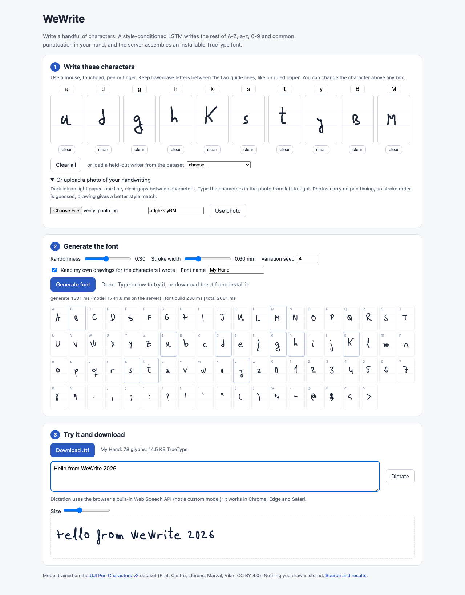
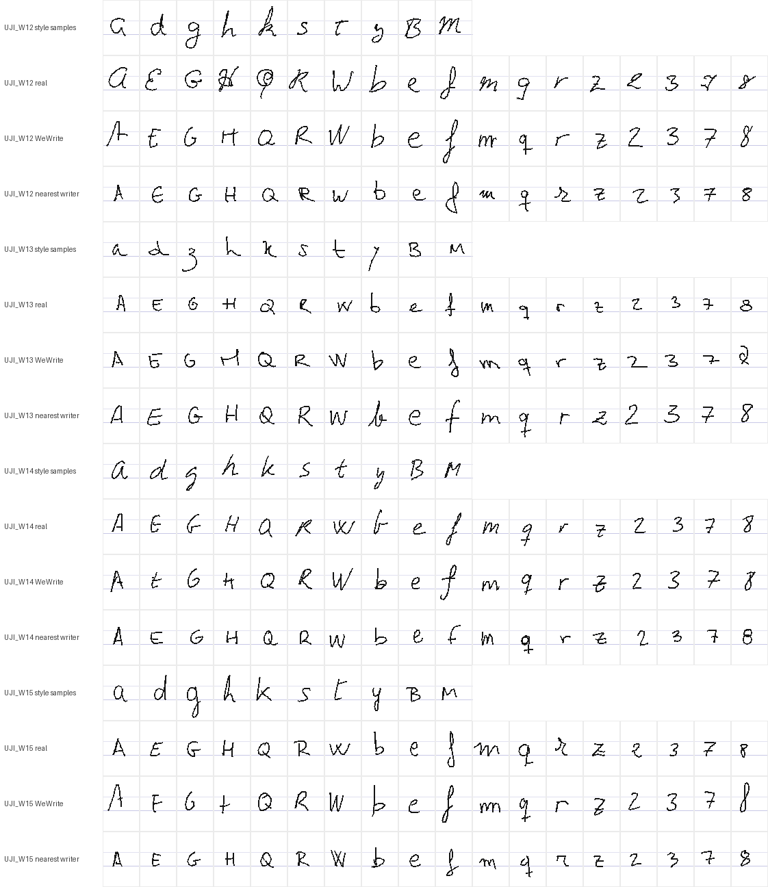

# WeWrite

Rebuilt from scratch in 2026. The original 2022-23 research code was not preserved.

This rebuild follows the research paper "Personalized Font Generation using Deep Learning Neural Networks". You write a handful of characters on a canvas, or upload a photo of them. A style-conditioned LSTM with a mixture density output writes the remaining characters (A-Z, a-z, 0-9 and 16 punctuation marks) in your hand, and a Django backend turns the pen strokes into an installable TrueType font. You can preview the font on text you type or dictate, then download it.

**Live:** https://wewrite-vert.vercel.app



## Contents

- [Dataset](#dataset)
- [Model](#model)
- [Training, ablations and tuning](#training-ablations-and-tuning)
- [Evaluation on held-out writers](#evaluation-on-held-out-writers)
- [Product walkthrough](#product-walkthrough)
- [Architecture and latency](#architecture-and-latency)
- [Reproducing](#reproducing)
- [Limitations](#limitations)

## Dataset

[UJI Pen Characters (Version 2)](https://archive.ics.uci.edu/dataset/177/uji+pen+characters+version+2), UCI Machine Learning Repository, DOI 10.24432/C5FG8S. Creators: F. Prat, M. Castro, D. Llorens, A. Marzal, J. Vilar. **License: Creative Commons Attribution 4.0 International (CC BY 4.0)**, as stated on the UCI page. `training/data.py` downloads it without a login. The data is not committed to this repo.

- 60 writers each wrote every character twice, in two separate sessions, with a stylus on a Tablet PC. Only x/y pen coordinates were recorded, stroke by stroke.
- I use the 62 alphanumerics and the 16 ASCII punctuation marks (`. , ; : ? ! ' " ( ) % - @ $ < >`). That gives 78 classes and 9,360 samples. The Spanish accented letters and non-ASCII symbols are dropped.
- Splits are by writer. I keep the official split: 40 "trn" writers and 20 "tst" writers. From the 40 trn writers I hold out 6 for validation (early stopping and model choice), which leaves 34 for training. **All reported results are on the 20 test writers, whom the model never saw.**
- Preprocessing: UPV coordinates are divided by 1.52 so both sites use the same scale (following the dataset notes), then converted to millimetres in the 13.6 x 20.4 mm acquisition box. Each stroke is resampled to 0.5 mm spacing, which gives a mean of 29.5 points per glyph (95th percentile 54). Glyphs keep their position in the box, so size, baseline and descenders are learned too. The drawing canvas in the app uses the same box and guide lines.

UJI was a good fit: it is online (stroke-sequence) data, has a clear license and needs no login. Its limits are its size (34 training writers) and that it holds isolated characters only.

## Model

`training/model.py` (PyTorch, for training) and `fontgen/infer.py` (NumPy, for serving; a test checks it against PyTorch).

- **Sequence format:** each step is (dx, dy, pen down, pen up, end), as in sketch-rnn. Offsets are measured in millimetres from the box centre. The decoder input also gets the absolute pen position and the number of strokes finished so far. Without these, the pen drifted and glyphs never ended.
- **Style encoder:** a bidirectional LSTM (128 per direction) reads each reference glyph along with its character embedding. The per-glyph vectors are averaged, then passed through tanh to give a 64-dimensional style vector. While training, each group of targets gets 1 to 10 same-writer references for *other* characters, so the model has to transfer style rather than copy a glyph.
- **Decoder:** an LSTM (384 units in the served model) conditioned on the character embedding (32 dimensions) and the style vector, which feed both its initial state and every input step. Its output is a mixture of 20 bivariate Gaussians over the next offset, plus a 3-way pen state (Graves 2013 / sketch-rnn). Served model: 1,070,011 parameters, 4.3 MB of float32 weights.
- **Writer augmentation:** each writer group gets one random affine transform (scale, aspect, slant, shift) applied to both its targets and its references. This creates consistent pseudo-writers.
- **Sampling:** temperature scales the offset mixture only. The pen state is sampled at temperature 1, because a sharpened pen distribution rarely lifts the pen. Finished sequences leave the batch, so all 78 characters decode together.
- **Best-of-N:** for each character, 8 candidates are sampled, and a small MLP reranker (16x24 raster, trained on the 34 training writers; 56.5% accuracy on validation writers) keeps the most recognisable one.
- **Geometric calibration** (`fontgen/calibrate.py`): the model also writes the characters the user drew. From the model's and the user's versions of those characters, one global affine (x/y scale about the baseline, slant, offset) is fitted from moments and applied to every generated glyph. The evaluation below shows that the style vector alone transfers little writer identity; calibration does most of it.

## Training, ablations and tuning

Adam(W) with learning rate 1e-3, gradient clipping at 1.0, batches of 8 writer groups x 8 targets, CPU (Apple M5, 1 to 3 threads). The LR schedule is ReduceLROnPlateau (factor 0.5, patience 4). Early stopping has patience 12 to 20 on validation-writer NLL and keeps the best checkpoint. NLL is reported in nats per stroke point, offsets in mm, including pen-state terms. Lower is better.

**Ablation of the original recipe** (the one named on the resume: dropout, LR scheduling, early stopping, plus augmentation). Every row starts from the same seed and changes one thing:

| Configuration | Val NLL | Test NLL | Best epoch | Epochs run |
|---|---|---|---|---|
| Original recipe: dropout 0.2 on decoder inputs and outputs, LR plateau schedule, early stopping, writer augmentation | -2.110 | -2.297 | 24 | 44 |
| No dropout | -3.672 | -3.976 | 148 | 168 |
| Dropout 0.2 on decoder outputs only | -3.879 | -4.122 | 188 | 200 |
| Without LR scheduling (constant 1e-3) | -2.054 | -2.218 | 22 | 42 |
| Without early stopping (60 epochs, last weights) | -0.680 | -0.707 | 24 | 60 |
| Without writer augmentation | -3.150 | -3.332 | 92 | 112 |
| Unconditioned (no style encoder) | -1.996 | -2.087 | 15 | 35 |

What this shows:

- **Early stopping** was the biggest factor for this recipe. Validation NLL peaks at epoch 24 and then gets much worse (the mixture's sigmas overfit the training writers). Keeping the best checkpoint gives -2.297 on the test writers; the weights after 60 epochs give -0.707.
- **LR scheduling** helped a little: -2.297 with the schedule, -2.218 without.
- **Dropout on the decoder inputs hurt.** Dropping pen offsets and positions corrupts the trajectory the LSTM has to follow. Removing all dropout improved test NLL from -2.297 to -3.976. Keeping dropout 0.2 on the LSTM outputs only did better still, at -4.122. The original recipe is therefore not the best configuration, and the served model does not use it.
- **Writer augmentation**, combined with input dropout, also cost NLL (-3.332 without it). I did not test augmentation off together with dropout off.

**Hyperparameter tuning** (chosen on validation writers only):

| Configuration | Params | Best val NLL | Test NLL | Epochs |
|---|---|---|---|---|
| hidden 256, no dropout, style | 647,483 | -3.672 | -3.976 | 168 |
| hidden 256, output dropout 0.2, style | 647,483 | -3.879 | -4.122 | 200 |
| **hidden 384, no dropout, style (served)** | 1,070,011 | **-3.996** | **-4.272** | 200 |
| hidden 256, no dropout, unconditioned | 454,459 | -3.740 | -4.067 | 200 |

In the served run, validation NLL was still improving slowly at the 200-epoch cap, so early stopping only chose the checkpoint (best epoch 187). Wall-clock times are in `results/training_runs.json`. They are not comparable across runs, because runs used different thread counts and shared the machine.

## Evaluation on held-out writers

`training/evaluate.py`, results in `results/evaluation.json`. For each of the 20 test writers, the 10 prompt characters the app asks for (`a d g h k s t y B M`) from session 1 are the style samples. The other 52 alphanumerics are then produced by each method and scored against that writer (1,040 glyphs per method). Generated rows average 2 sampling seeds (± is the std across seeds); T = 0.3.

The judges are separate CNNs that see the glyph rasterised in the full box:
- **Character CNN:** 62-way, trained only on the 40 trn writers. It scores 80.3% on all real test-writer glyphs. Most errors are inherently ambiguous pairs: o/O/0, l/I/1, s/S, c/C, and so on.
- **Writer CNN:** 20-way over the test writers, given the character, trained only on their session-1 glyphs. It is scored on session-2 glyphs (real) or on generated ones. "Per writer" sums its log-probabilities over the 52 glyphs of a set.
- **Chamfer:** the symmetric point-cloud distance, in mm, to the writer's real session-2 glyph of the same character.

| Method | Char accuracy (62-way) | Writer ID, per glyph (chance 5%) | Writer ID, per writer | Chamfer to real (mm) |
|---|---|---|---|---|
| Real session-2 glyphs (reference) | 80.4% | 42.4% | 95% | 0.000 |
| Nearest real sample (closest training writer by chamfer on the prompts) | 93.3% | 8.5% | 10% | 0.835 |
| Nearest real sample + calibration | 86.8% | 17.1% | 35% | 0.821 |
| **WeWrite: style vector + calibration, best of 8 (served)** | 87.2% ± 0.6 | **23.7% ± 0.6** | **42%** | **0.784 ± 0.016** |
| WeWrite: style vector only, best of 8 | 88.5% ± 0.3 | 9.7% ± 0.6 | 22% | 0.807 ± 0.003 |
| WeWrite: style vector only, single sample | 61.6% ± 2.3 | 9.7% ± 0.4 | 20% | 1.804 ± 0.952 |
| Unconditioned model + calibration, best of 8 | 79.5% ± 3.9 | 14.2% ± 0.6 | 32% | 0.843 ± 0.006 |
| Unconditioned model, best of 8 | 86.5% ± 1.9 | 5.0% | 5% | 0.946 ± 0.017 |
| Unconditioned model, single sample | 50.0% ± 3.8 | 5.0% | 5% | 1.913 ± 0.937 |

Reading the table:

- **Recognisability:** the served glyphs are recognised 87.2% of the time, while real handwriting from the same writers scores 80.4%. Best-of-8 reranking is what makes the difference: single samples score 61.6%. The reranker was trained on the same training writers as the judge, though it is a different network, so part of this gain may reflect agreement between classifiers trained on the same data.
- **Style:** the served pipeline identifies the target writer from a single glyph 23.7% of the time (chance is 5%, real session-2 glyphs reach 42.4%), and from a full 52-glyph set 42% of the time (real: 95%). That beats both baselines: copying the closest training writer (8.5% / 10%, or 17.1% / 35% with calibration) and the unconditioned model with calibration (14.2% / 32%). The style vector alone gives only 9.7%. The geometric calibration, together with the style vector, does most of the style transfer.
- **Shape:** the served glyphs are the closest to the writer's real glyphs of any method, at a chamfer distance of 0.784 mm.
- **NLL vs number of style samples** (served model, test writers). It improves only slightly with more references. The unconditioned 256-unit model scores -4.067, so the style encoder's likelihood gain is small:

| Style samples K | 1 | 3 | 5 | 10 | 20 |
|---|---|---|---|---|---|
| Test NLL (nats/point) | -4.234 | -4.247 | -4.272 | -4.293 | -4.292 |

- **Temperature** (served pipeline). 0.3 is the default: it gives the best character accuracy while keeping style close to the best setting.

| Temperature | Char accuracy | Writer ID per glyph | Writer ID per writer | Chamfer (mm) |
|---|---|---|---|---|
| 0.05 | 82.9% | 24.4% | 45% | 0.765 |
| 0.15 | 87.1% | 20.0% | 40% | 0.775 |
| 0.3 | 87.2% | 23.7% | 42% | 0.784 |
| 0.6 | 85.0% | 18.1% | 40% | 0.815 |
| 1.0 | 73.1% | 17.1% | 45% | 0.858 |

Rows below: style samples, real session 2, WeWrite, nearest training writer, for four test writers.



The resume entry for the original project listed percentage improvements (latency, training time, generalization, performance). The original code and logs are gone, so those figures cannot be checked. This README reports only the measurements above.

## Product walkthrough

1. **Write.** Ten boxes with x-height and baseline guides ask for `a d g h k s t y B M`. Any box can be relabelled to a different character. Drawing uses Pointer Events (mouse, touchpad, pen, touch), including coalesced events for smooth strokes. You can also load one of four held-out dataset writers to try the app without drawing.
2. **Or upload a photo** of one line of handwriting and type its characters left to right. The server (`fontgen/vectorize.py`) evens out the lighting and applies an Otsu threshold. It then finds connected components and groups them into characters by horizontal overlap, thins them with Zhang-Suen, and traces the skeleton into strokes, joining at junctions along the straightest continuation. Finally it places each character in the box using mean character positions measured on the training writers. The traced strokes fill the boxes so you can check them before generating.
3. **Generate.** `/api/generate` encodes your samples, samples 8 candidates for each of the 78 characters, reranks them, applies calibration, and returns the strokes. By default the characters you drew are kept exactly as drawn.
4. **Font.** `/api/font` smooths each stroke (Chaikin), thickens it into a round-capped outline with Shapely, unions the outlines, and writes TrueType contours (clockwise outer rings, counter-clockwise holes) with fontTools' FontBuilder. The result has proportional advance widths and real ascender, descender and x-height metrics. Changing the stroke width or the font name rebuilds the font without regenerating the glyphs.
5. **Use it.** The browser loads the TTF with the FontFace API and renders your text in it. **Dictate** uses the browser's built-in Web Speech API, which is not a custom model and only works in browsers that provide it (Chrome, Edge, Safari). **Download .ttf** saves a font you can install on macOS, Windows or Linux.

## Architecture and latency

```
browser (static HTML/JS on Vercel CDN)
  -> Django 5.2 on Vercel's Python runtime (one function)
       /api/style      style vector from samples
       /api/generate   samples or style -> strokes for all glyphs (NumPy LSTM, rerank, calibrate)
       /api/font       strokes -> TTF (Shapely + fontTools), X-Font-Info header with a parse report
       /api/vectorize  photo + labels -> strokes
       /api/health
```

PyTorch alone would exceed the function size limit, so inference is a NumPy port of the LSTM. The deployed function is about 61 MB with NumPy, Shapely, Pillow, fontTools and Django. The app is stateless: the style vector and the strokes travel with each request, and nothing is stored.

**Latency on the live site**, measured from a headless Chromium session on my machine by `scripts/verify_site.py`, over 5 generate-and-build cycles:

| Step | First request | Median of the next 4 |
|---|---|---|
| `/api/generate` (78 glyphs, best of 8) | 1,895 ms | 1,921 ms |
| of which server model time | about 1,840 ms | |
| `/api/font` (build TTF) | 236 ms | 234 ms |
| Generate plus font, as seen by the user | 2,151 ms | 2,198 ms |
| `/api/vectorize` (photo, 10 characters) | 207 ms | |
| Page load (networkidle) | 759 ms | |

Full numbers are in `results/live_verification.json`. For comparison, the same generate step takes about 220 ms on the local Apple M5 CPU.

**Verification:** `scripts/verify_site.py` opens the live URL in Playwright. It draws the ten prompt characters with mouse events (strokes from a held-out writer), generates, checks the preview font loaded, and downloads the `.ttf`. It then parses the file with fontTools and checks that all 62 alphanumerics are present with non-empty outlines. It also renders the same characters as a photo, uploads it, and confirms the boxes fill and a font generates from it. The latest run passed. The downloaded font had 80 glyphs (.notdef, space, 62 alphanumerics, 16 punctuation marks) and was 14.9 KB.

## Reproducing

```bash
uv sync --group dev --group train
uv run python -m training.data                       # download + preprocess
uv run python -m training.train --tag hp_h384 --hidden 384 --dropout 0 --max-epochs 200 --patience 20
uv run python -m training.train --tag uncond_nodrop --no-style --dropout 0 --max-epochs 200 --patience 20
uv run python -m training.train_reranker
uv run python -m training.char_stats
uv run python -m training.export --tag hp_h384 --name wewrite
uv run python -m training.export --tag uncond_nodrop --name uncond
uv run python -m training.evaluate --run hp_h384 --uncond-run uncond_nodrop --seeds 2
uv run python -m training.report                     # tables above
DJANGO_DEBUG=1 uv run python manage.py runserver     # local app at http://127.0.0.1:8000
uv run pytest -q
uv run --with playwright --with fonttools --with pillow --python 3.12 python scripts/verify_site.py <url>
```

The ablation runs use the flags `--dropout 0`, `--output-dropout-only`, `--no-sched`, `--no-es`, `--no-aug` and `--no-style`. CI (`.github/workflows/ci.yml`) runs the test suite with the serving dependencies, and separately checks the NumPy port against PyTorch.

## Limitations

- **Small data:** 34 training writers of isolated characters. Style transfer is real but partial: 23.7% per-glyph writer identification, against 42.4% for the writer's own second session. Most of it comes from geometry (size, slant, placement); stroke-level idiosyncrasies transfer weakly.
- **Weak glyphs:** some characters stay poor, especially capitals with several strokes such as E, H and A, which are sometimes malformed.
- **Separate glyphs only:** there is no cursive joining, no kerning, and no glyph variants. Each character has exactly one shape.
- **Photo input** needs dark ink on light paper, one line, and visible gaps between characters. A photo has no pen timing, so stroke order and direction are guessed. The style encoder was trained on real pen trajectories, so a photo gives a weaker style signal than drawing. Touching or overlapping characters fail with an error.
- **Character set:** 78 characters. Accented letters and other symbols are not generated.
- **Dictation** depends on the browser's Web Speech API. Some browsers send the audio to their vendor's speech service.
- **Evaluation caveat:** the recognisability judge and the reranker are both trained on the training-pool writers. The writer judge only knows the 20 test writers.

## License

Code: MIT (see `LICENSE`). Dataset: CC BY 4.0, credited above. It is not redistributed here.
